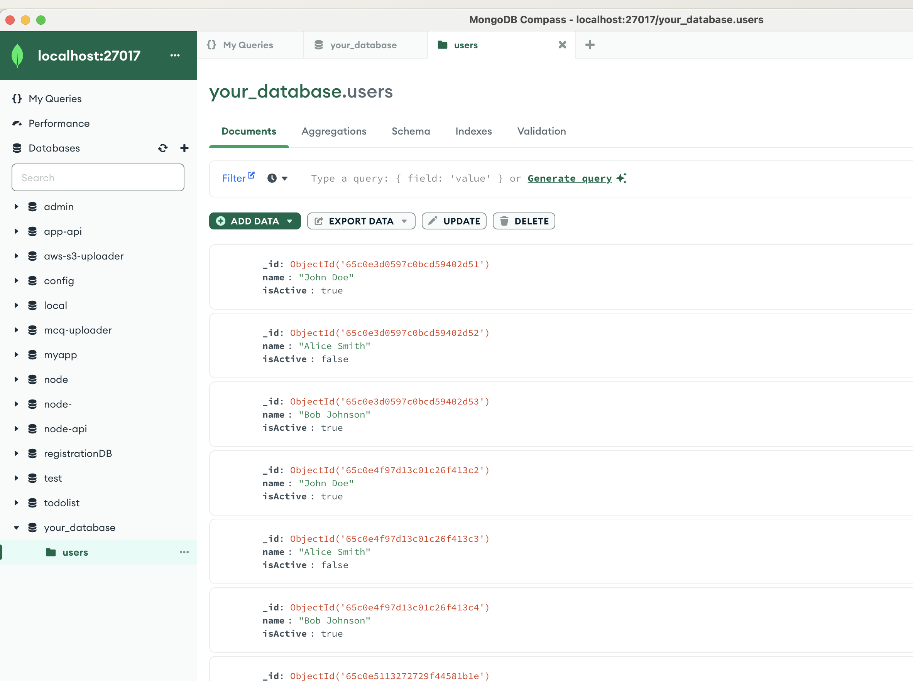

# Python- MongoDB

Write a Python function to connect to a MongoDB database and retrieve all documents from a collection named 'users' that have the field 'isActive' set to true. Display the results in a formatted way.

## Table of Contents

- [Introduction](#introduction)
- [Prerequisites](#prerequisites)
- [Installation](#installation)
- [Usage](#usage)
- [Contributing](#contributing)
- [License](#license)

## Introduction

Brief introduction and purpose of your project.


## Screenshots


*Output of app.py*


*MongoDB Collections *


## Prerequisites

List any prerequisites or dependencies that users need to install before using your project.

- Python 3.x
- MongoDB
- Other dependencies...

## Installation

1. Clone the repository:

   ```bash
   git clone https://github.com/manish-jsx/py-mongo.git
   ```

2. Navigate to the project directory:

   ```bash
   cd py-mongo
   ```

3. Set up the virtual environment:

   ```bash
   python -m venv venv
   ```

4. Activate the virtual environment:

   ```bash
   source venv/bin/activate  # On Windows, use `venv\Scripts\activate`
   ```

5. Install dependencies:

   ```bash
   pip install -r requirements.txt
   ```

6. Create a `.env` file and configure environment variables.

7. Seed data into the MongoDB database:

   ```bash
   python app.py
   ```

## Usage

Explain how to use your project. Include examples, command-line options, or API documentation.

```bash
python app.py
```

